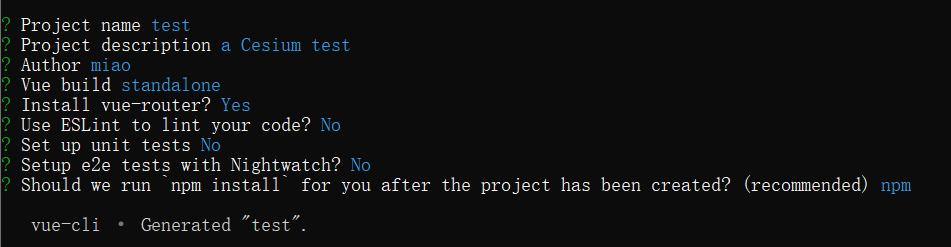
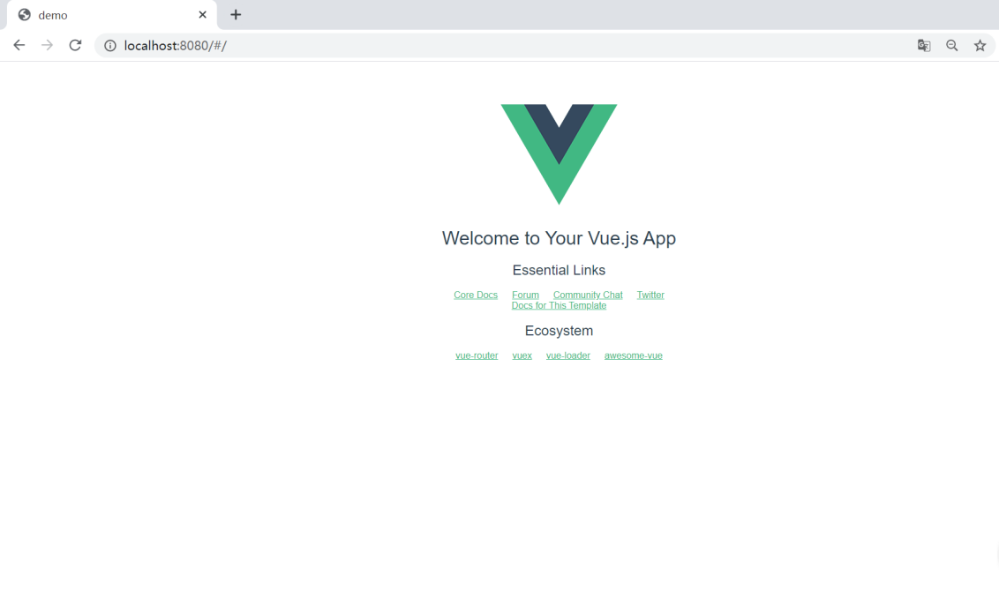
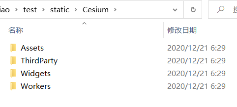
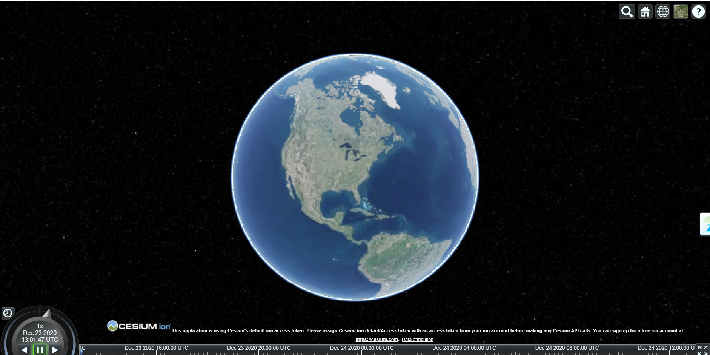

### 1. 安装node.js——无情的下包机器
①下载并安装node包 https://nodejs.org/en/  
②命令行输入` node -v`查看node版本  
②命令行输入`npm -v`查看npm版本  
详细教程可参考 https://www.liaoxuefeng.com/wiki/1022910821149312/1023025597810528  
### 2. 安装vue和vue-cli——轻量实用的前端框架 
①安装vue：命令行输入 `npm install vue`  
补充教程：https://vuejs.org/v2/guide/installation.html  
②安装vue-cli：命令行输入 `npm install -g @vue/cli`  
补充教程： https://cli.vuejs.org/guide/installation.html
### 3. 基于vue-cli快速搭建项目——vue版Hello World
命令行输入 `vue init webpack test`，test是项目名称，配置详情如下：  
  
命令行输入 `npm run dev`启动项目，浏览器输入 http://localhost:8080/#/ ，可以看到第一个vue页面  

### 4. 安装Cesium——三维空间解决方案  
在当前项目的根目录打开命令行，输入 `npm install --save cesium` 
### 5. 引入Cesium——Cesium版Hello World  
①为Cesium添加静态文件  
根目录新建文件夹static，拷贝node_modules/cesium/Build/Cesium文件夹至static，删除Cesium.d.ts和Cesium.js，结果如下图所示：  
  
补充教程：https://cesium.com/docs/tutorials/quick-start/#next-steps  
②修改HelloWorld.vue  
```
<template>
  <div id="cesiumContainer"></div>
</template>
<script>
window.CESIUM_BASE_URL = "/static/Cesium/";
import * as Cesium from "cesium";
import "cesium/Build/Cesium/Widgets/widgets.css";
export default {
  name: "HelloWorld",
  mounted() {
    this.viewer = new Cesium.Viewer("cesiumContainer", {
      terrainProvider: Cesium.createWorldTerrain(),
    });
  },
  data() {
    return {};
  },
};
</script>
```
③样式调整   
打开App.vue，删除img，注掉margin-top的样式（会好看一点点，不操作也不会影响功能）
```
<template>
  <div id="app">
    <router-view/>
  </div>
</template>

<script>
export default {
  name: 'App'
}
</script>
<style>
#app {
  font-family: 'Avenir', Helvetica, Arial, sans-serif;
  -webkit-font-smoothing: antialiased;
  -moz-osx-font-smoothing: grayscale;
  text-align: center;
  color: #2c3e50;
  /*margin-top: 60px;*/
}
</style>
```
### 6. 看见世界  
命令行输入 `npm run dev`，再次进入 http://localhost:8080/#/ ，they say Hello World！  

注：有时候用npm run serve,有时候用npm run dev，取决于package.json中start的写法
