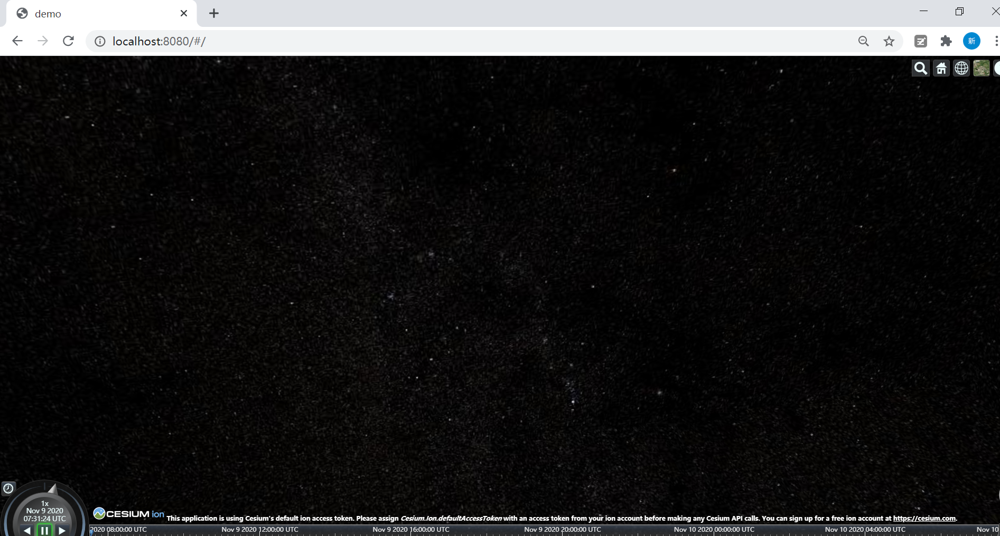

### 1. 安装node.js和npm——无情的下包机器  
详细教程可参考 https://www.liaoxuefeng.com/wiki/1022910821149312/1023025597810528  
### 2. 安装vue和vue-cli——轻量实用的前端框架 
①安装vue：命令行输入 `npm install vue`  
补充教程：https://vuejs.org/v2/guide/installation.html  
②安装vue-cli：命令行输入 `npm install -g @vue/cli`  
补充教程： https://cli.vuejs.org/guide/installation.html
### 3. 基于vue-cli快速搭建项目——vue版Hello World
命令行输入 `vue init webpack demo`，demo是项目名称  
浏览器输入 http://localhost:8080/#/ ，可以看到第一个vue页面  

### 4. 安装Cesium——三维空间解决方案  
命令行输入 `npm install cesium` 
### 5. 引入Cesium——Cesium版Hello World  
①添加组件cesiumViewer.vue   
```
```
②App.vue引入组件  
```
<script>
import cesiumViewer from './components/cesiumViewer.vue'
export default {
  name: 'App',
  components: {
    'cesiumViewer': cesiumViewer
  }
}
</script>
```
③修改路由index.js  
```
import Vue from 'vue'
import Router from 'vue-router'
import cesiumViewer from '@/components/cesiumViewer'

Vue.use(Router)

export default new Router({
  routes: [
    {
      path: '/',
      name: 'cesiumViewer',
      component: cesiumViewer
    }
  ]
})
```
### 6. 看见世界  
命令行输入 `npm run serve`，再次进入 http://localhost:8080/#/ ，宇宙星辰在冲我们挥手  

注：有时候用npm run serve,有时候用npm run dev，取决于package.json中start的写法
